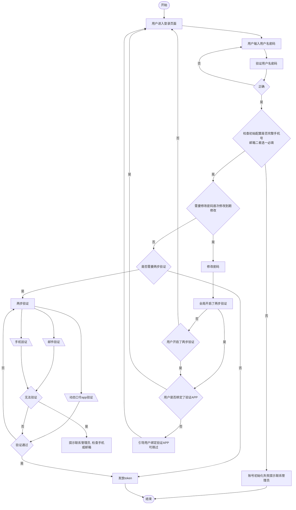

# 登录流程

```mermaid
flowchart TB
START([开始])-->A[用户进入登录页面]
A-->B[用户输入用户名密码]
B-->C[验证用户名密码]
C-->D{正确}
D-->|是|D1{检查初始配置是否完整手机号\n邮箱二者选一必填}
D-->|否|B
D1-->|是|E{需要修改密码首次修改到期修改}
D1-->|否|D2[账号初始化失败提示联系管理员]
D2-->END
E-->|是|F[修改密码]
E-->|否|K{是否需要两步验证}
K-->|是|K1[两步验证]
K-->|否|T
K1-->K13[\动态口令app验证\]
K13-->L{验证通过}
K1-->K11[\邮件验证\]
K1-->K12[\手机验证\]
K11-->K21{无法验证}
K12-->K21
K21-->|是|K3[提示联系管理员, 检查手机或邮箱]
K21-->|否|L
L-->|是|T[发放token]
L-->|否|K1
F-->G[全局开启了两步验证]
G-->|是|H{用户是否绑定了验证APP}
G-->|否|I{用户开启了两步验证}
I-->|是|H
I-->|否|A
H-->|是|A
H-->|否|J[引导用户绑定验证APP\n可跳过]
J-->A
T-->END([结束])

```

