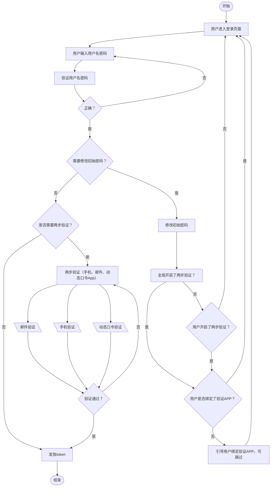

# 登录流程

```mermaid
flowchart TB
START([开始])-->A[用户进入登录页面]
A-->B[用户输入用户名密码]
B-->C[验证用户名密码]
C-->D{正确？}
D-->|是|E
D-->|否|B
E{需要修改初始密码？}
E-->|是|F[修改初始密码]
E-->|否|K{是否需要两步验证？}
K-->|是|K1[两步验证（手机、邮件、动态口令App）]
K1-->K11[\邮件验证\]
K1-->K12[\手机验证\]
K1-->K13[\动态口令验证\]
K11-->L{验证通过？}
K12-->L{验证通过？}
K13-->L{验证通过？}
K-->|否|T
L-->|是|T[发放token]
L-->|否|K1

F-->G[全局开启了两步验证？]
G-->|是|H{用户是否绑定了验证APP？}
G-->|否|I{用户开启了两步验证？}
I-->|是|H
I-->|否|A
H-->|是|A
H-->|否|J[引导用户绑定验证APP，可跳过]
J-->A
T-->END([结束])
```
